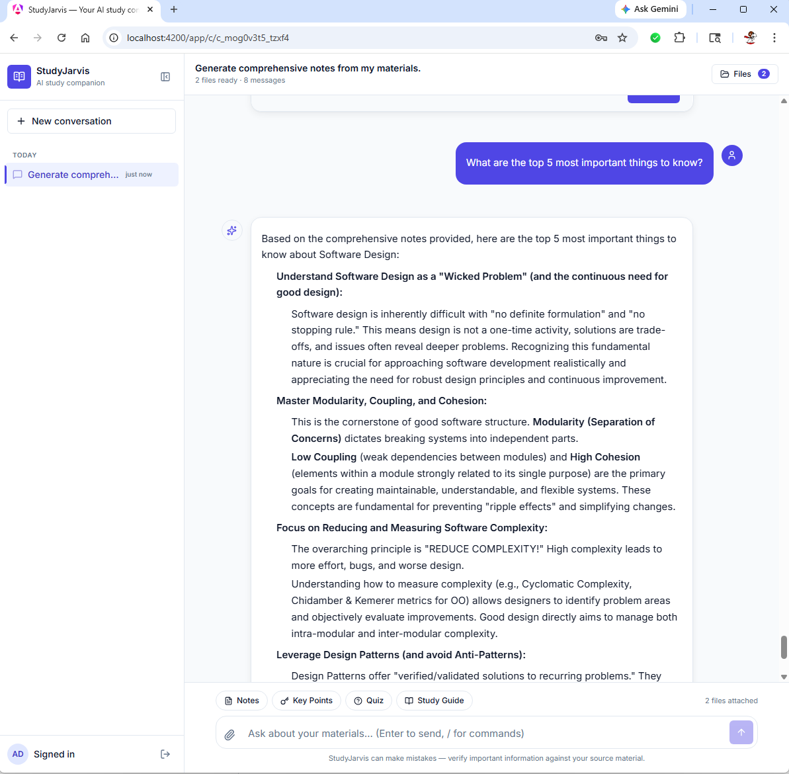
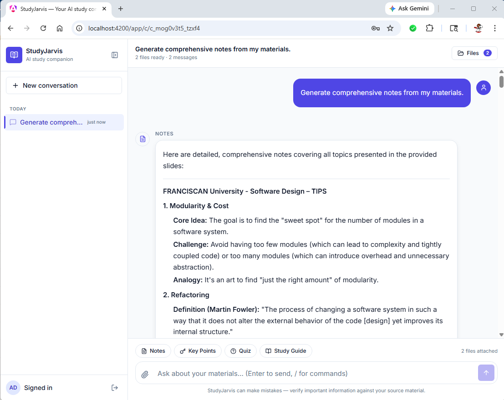
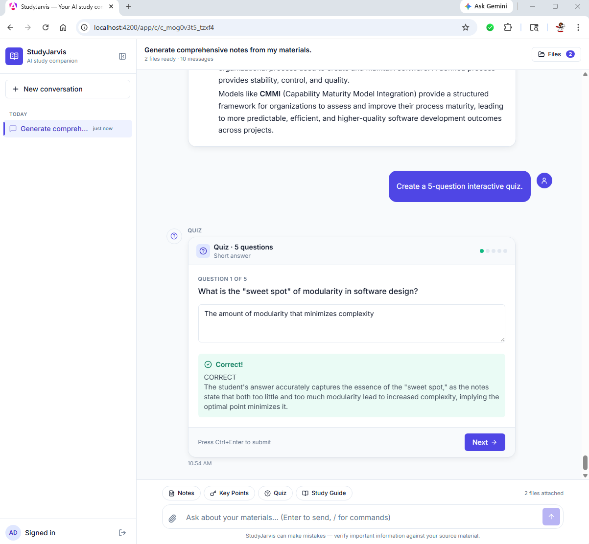
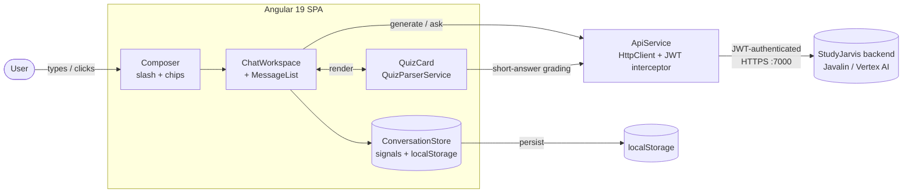
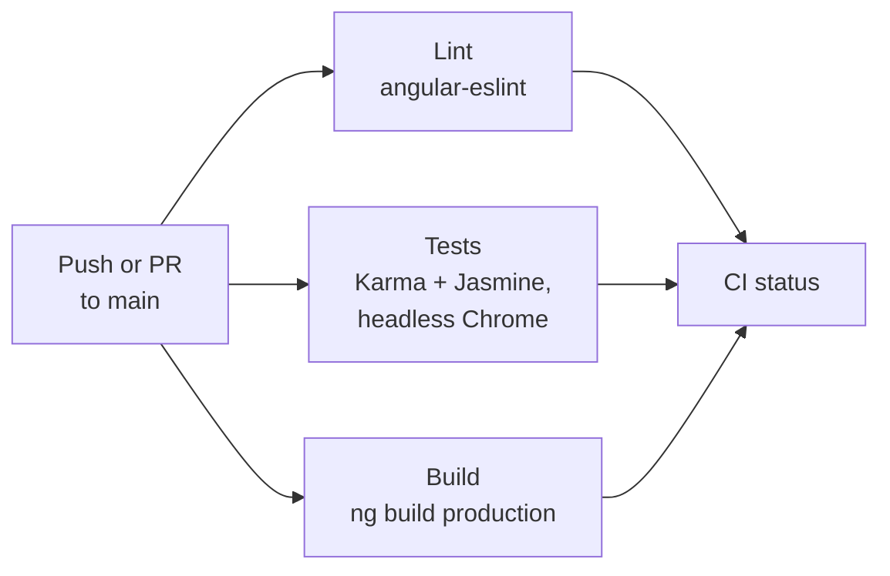

# StudyJarvis Webapp

[](https://github.com/Thomas-J-Barreras-Consulting/studyjarviswebapp/actions/workflows/ci.yml)
[](https://angular.dev/)
[](https://www.typescriptlang.org/)

**Chat-first Angular workspace for [StudyJarvis](https://github.com/Thomas-J-Barreras-Consulting/studyjarvis) — drop in PDFs and PowerPoints, then ask, generate notes, key points, study guides, and interactive quizzes powered by Google Gemini.**


## Overview

This is the user-facing companion to the [StudyJarvis backend](https://github.com/Thomas-J-Barreras-Consulting/studyjarvis). It's a signal-based, OnPush, standalone-component Angular 19 SPA that consumes the backend's JWT-authenticated REST API and renders Gemini-generated markdown into interactive UI — including an in-place quiz parser with auto-grading for multiple-choice and LLM-graded short-answer.

## Screenshots

<div align="center">

| Ask | Comprehensive notes | Interactive quiz |
| :---: | :---: | :---: |
|  |  |  |

</div>

## Architecture



The SPA is fully client-side. State (conversations, attached files, sidebar collapse) lives in a [signal-based store](src/app/core/conversation.store.ts) backed by `localStorage`. Every cross-component interaction flows through that store; `effect()` mirrors changes to disk on each tick.

## Tech stack

| Layer | Tech |
| --- | --- |
| **Framework** | Angular 19, standalone components throughout |
| **Reactivity** | Signals — `signal()`, `computed()`, `effect()`, `input.required()` — paired with `ChangeDetectionStrategy.OnPush` |
| **Routing / forms** | `@angular/router`, `@angular/forms`, route-level `auth.guard` |
| **State** | Custom `ConversationStore` (signal store, `localStorage`-persisted) |
| **HTTP** | `HttpClient` + `auth.interceptor` for JWT bearer injection |
| **Markdown / code** | `ngx-markdown`, `marked`, `prismjs` for syntax highlighting |
| **Iconography** | `lucide-angular` |
| **Layered components** | CDK primitives via `@angular/cdk` |
| **Styling** | Tailwind utility classes + design tokens |
| **Testing** | Karma + Jasmine, headless Chrome, code-coverage |
| **Lint** | `angular-eslint` + `typescript-eslint` |
| **CI** | GitHub Actions, Node 20 + 22 matrix, lint → test → production build |
| **Backend** | [studyjarvis](https://github.com/Thomas-J-Barreras-Consulting/studyjarvis) — Java 17 / Javalin / Vertex AI Gemini |

## Engineering highlights

- **Fully signal-driven, no `Subject`/`BehaviorSubject` for app state.** [ConversationStore](src/app/core/conversation.store.ts) exposes `WritableSignal`s (conversations, activeId, files, sidebar collapse) plus `computed()` derivations like `active`, `sortedConversations`, `messages`. `effect()`s sync each slice to `localStorage` on change — the persistence layer is reactive, not imperative.
- **`input.required()` everywhere a child reads from a parent inside `computed()` / `effect()`.** Avoiding the trap where a plain `@Input` field is read inside a `computed()` and never invalidates: when [QuizCardComponent](src/app/chat/quiz/quiz-card.component.ts) needs to react to a new quiz handed in by the parent, it uses `quiz = input.required<Quiz>()` and reads `this.quiz()` everywhere. Regression-tested in the spec.
- **Bulletproof quiz parser.** [QuizParserService](src/app/chat/quiz/quiz-parser.service.ts) takes raw markdown from Gemini and produces a typed `Quiz` (multiple-choice or short-answer). Handles three answer-section variants (`## Answers`, `**Answers:**`, plain `Answers:`), de-duplicates choice keys when the LLM repeats them, strips bold markers from stems, and falls back to short-answer if fewer than half the questions parse with choices.
- **Quiz card with two grading paths.**
  - **Multiple-choice** — graded synchronously against `correctKey` from the parsed answers section.
  - **Short-answer** — submitted to the backend's `askQuestion` endpoint with a structured rubric (`"Reply CORRECT or INCORRECT then a one-sentence explanation"`); the parsed first-line verdict drives the green/red feedback.
- **Keyboard-first ergonomics.** `1`–`N` selects a choice, `Enter` submits, `Ctrl+Enter` submits short-answer, `↑` recalls the previous prompt in the composer, `Esc` cancels slash-command mode.
- **Clean composer with slash commands.** `/notes`, `/keypoints`, `/quiz [N]`, `/studyguide` map to their backend endpoints; `/quiz 8` is parsed into `numberOfQuestions: 8`.
- **CI matrix.** Lint, full Karma test suite (headless Chrome), and a production `ng build` run on Node 20 *and* 22 on every push.

## Quick start

```bash
git clone https://github.com/Thomas-J-Barreras-Consulting/studyjarviswebapp
cd studyjarviswebapp
npm install
npm start                 # ng serve on http://localhost:4200
```

The webapp expects the [StudyJarvis backend](https://github.com/Thomas-J-Barreras-Consulting/studyjarvis) running on `http://localhost:7000` (the URL is currently hard-coded in [api.service.ts](src/app/api.service.ts)).

For one-command full-stack local dev (backend + webapp in two pwsh windows), see [`dev.ps1`](https://github.com/Thomas-J-Barreras-Consulting/studyjarvis#quick-start) in the backend repo.

## CI Pipeline



The full pipeline runs against a Node 20 + 22 matrix on every push and PR. Coverage and the production bundle are uploaded as artifacts.

| Job | Tools | Purpose |
| --- | --- | --- |
| **Lint** | `angular-eslint` + `typescript-eslint` | Style and TS rule enforcement |
| **Tests** | Karma + Jasmine, headless Chrome | Unit and component tests with coverage |
| **Build** | Angular CLI production build | Catches AOT / template type errors before merge |

Run the same checks locally:

```bash
npm run lint
npm run test:ci           # headless Chrome + coverage
npm run build
```

## Development

### Project structure

```
src/app/
├── api.service.ts              # HttpClient wrapper for the StudyJarvis API
├── auth.interceptor.ts         # Injects the JWT bearer on every secured call
├── auth.service.ts             # Login / logout / token storage
├── login/                      # Login screen
├── core/
│   ├── auth.guard.ts           # Route guard for /app/**
│   ├── conversation.store.ts   # Signal-based state, localStorage-persisted
│   ├── models.ts               # Conversation, Message, Quiz, Question, ...
│   ├── toast.service.ts        # App-wide toasts with a host component
│   ├── format-bytes.pipe.ts    # File-size pipe
│   └── relative-time.pipe.ts   # "5m ago" pipe
├── chat/
│   ├── chat-workspace.component.{ts,html}
│   ├── sidebar/                # Conversation list + new-chat button
│   ├── composer/               # Textarea + slash commands + quick-action chips
│   ├── message/                # Per-message renderer (markdown / quiz / error / typing)
│   ├── file-drawer/            # Drag-and-drop file uploader
│   └── quiz/
│       ├── quiz-card.component.{ts,html,spec.ts}
│       └── quiz-parser.service.{ts,spec.ts}
├── app.routes.ts
└── app.component.{ts,html}
```

### Common commands

```bash
npm start                  # ng serve              (dev server on :4200)
npm run watch              # ng build --watch      (rebuild artifacts on change)
npm run build              # ng build              (production)
npm test                   # ng test               (Karma, watch mode, with browser)
npm run test:ci            # ng test --no-watch    (headless Chrome + coverage)
npm run lint               # ng lint               (angular-eslint)
```

### Generating components / services

```bash
ng generate component path/to/component-name
ng generate service path/to/service-name
ng generate --help
```

### Resources

- [Angular CLI Overview](https://angular.dev/tools/cli)
- [Angular Signals](https://angular.dev/guide/signals)
- [angular-eslint](https://github.com/angular-eslint/angular-eslint)
- [Karma test runner](https://karma-runner.github.io)
